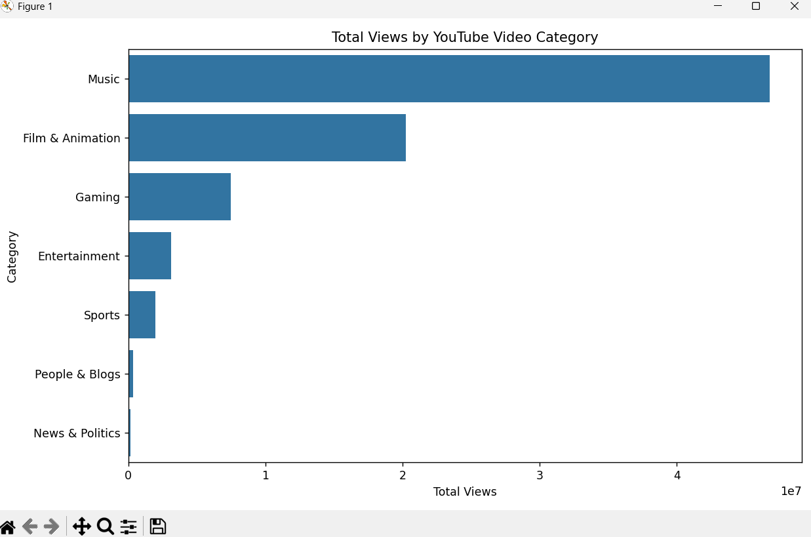

# 📊 YouTube Data Collection & Content Performance Analysis

## 📌 Project Overview
This project focuses on collecting **real-time YouTube trending video data** using the **YouTube Data API v3**
and analyzing content performance and audience engagement using **Python, Excel, and data visualization**.

The objective is to understand:
- Which content categories perform best
- How engagement differs from raw views
- How data insights can support content and marketing strategies

---

## 🛠 Tools & Technologies Used
- **Python**
- **YouTube Data API v3**
- **Pandas, NumPy**
- **Microsoft Excel**
- **Matplotlib, Seaborn**
- **Git & GitHub**

---

## 🔄 Project Workflow
1. Enable YouTube Data API v3 in Google Cloud Console  
2. Fetch real-time trending video data using Python  
3. Validate and summarize raw data using Excel  
4. Clean and transform data using Pandas  
5. Perform exploratory data analysis (EDA)  
6. Visualize insights and interpret results  

---

## 📊 Key Visualizations & Insights

### 🔹 Views by Category
This chart shows total views across different YouTube content categories.

**Insight:**  
Most videos have low-to-medium engagement, while only a few achieve very high interaction.

---

## 📈 Key Outcomes
- Identified high-performing content categories
- Highlighted the difference between visibility and engagement
- Demonstrated how real-time data can support content strategy decisions

---

## 🌍 Real-World Applications
- Helps **content creators** focus on engagement-driven content
- Supports **digital marketing teams** in category targeting
- Enables **data-driven content planning** using live platform data

---

## 🚀 Future Enhancements
- Automate daily data collection
- Store data in a SQL database
- Build an interactive dashboard
- Perform trend forecasting

---

## 👤 Author
**Dinesh**  
Data Analytics | Python | SQL | Excel
